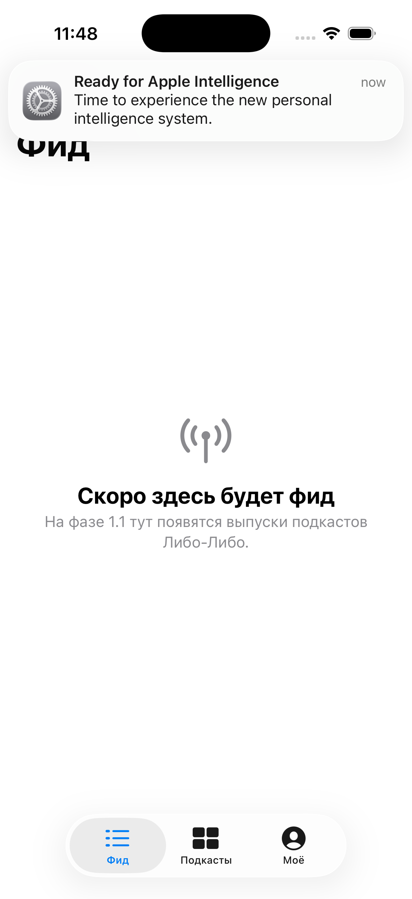

# 2026-04-25 — Шаг 1.0: пустое приложение запускается (сессия 3)

**Контекст:** после фиксации стека и параметров (см. [сессию 02](2026-04-25-02-corrections.md)) и публикации [спецификации шага 1](../specs/step-01-ios-skeleton.md) Илья дал отмашку «погнали». Эта сессия — выполнение фазы 1.0.

## Что сделано

Поднят минимальный скаффолд iOS-приложения: пустое приложение с тремя вкладками (Фид / Подкасты / Моё) запускается в симуляторе и не падает.

### Файлы

- [`project.yml`](../../project.yml) — XcodeGen-описание проекта (target `LiboLibo`, iOS 18.0+, bundle id `me.libolibo.app`, display name «Либо-Либо»).
- [`LiboLibo/App/LiboLiboApp.swift`](../../LiboLibo/App/LiboLiboApp.swift) — `@main`-точка входа.
- [`LiboLibo/App/RootView.swift`](../../LiboLibo/App/RootView.swift) — `TabView` с тремя вкладками.
- [`LiboLibo/Features/Feed/FeedView.swift`](../../LiboLibo/Features/Feed/FeedView.swift), [`Podcasts/PodcastsView.swift`](../../LiboLibo/Features/Podcasts/PodcastsView.swift), [`Profile/ProfileView.swift`](../../LiboLibo/Features/Profile/ProfileView.swift) — заглушки на `ContentUnavailableView` с подписями про следующие фазы.
- [`LiboLibo/Resources/Assets.xcassets`](../../LiboLibo/Resources/Assets.xcassets) — пустой `AppIcon` и дефолтный `AccentColor`.

### Тулчейн (то, что обнаружилось локально)

- xcodegen 2.45.4 (через homebrew)
- Xcode 26.4.1
- Симулятор iPhone 17 (iOS 26.4 SDK, deployment target 18.0)

### Результат сборки

```
xcodebuild -project LiboLibo.xcodeproj -scheme LiboLibo \
  -sdk iphonesimulator -destination 'platform=iOS Simulator,name=iPhone 17' \
  -configuration Debug build
...
** BUILD SUCCEEDED **
```

После `simctl install` + `simctl launch me.libolibo.app` приложение запускается, видна нижняя панель из трёх вкладок, на «Фиде» — `ContentUnavailableView` с антенной, заголовком «Скоро здесь будет фид» и подписью.

### Скриншот



(Баннер «Ready for Apple Intelligence» сверху — это системное уведомление симулятора при первой загрузке, не часть приложения.)

## Что НЕ сделано (по плану)

Всё, что относится к фазам 1.1+ — моки, RSS, плеер, SwiftData, иконка, шрифт, brand-цвета. Открытый вопрос про шрифт (Gerbera vs OFL-альтернативы) остаётся.

## DoD фазы 1.0 — все галочки закрыты

- [x] `project.yml` описывает iOS-приложение, минимальный таргет iOS 18.
- [x] `xcodegen generate` создаёт работоспособный `.xcodeproj`.
- [x] `xcodebuild` собирает без ошибок.
- [x] При запуске видна нижняя панель с тремя вкладками; тапы переключают экраны.
- [x] Коммит запушен; `.xcodeproj` НЕ попал в репо (исключён через `.gitignore`).
- [x] Сессия задокументирована (этот файл).

## Как это запустить локально

```bash
git clone https://github.com/Krasilshchik3000/LiboLibo.git
cd LiboLibo
brew install xcodegen
xcodegen generate
open LiboLibo.xcodeproj   # → Xcode → Cmd+R
```

## Дальше — фаза 1.1

Моки на «Фиде»: список из 5 фейковых выпусков (структуры `Episode`, простой `List` с ячейками). Ждём «погнали».
