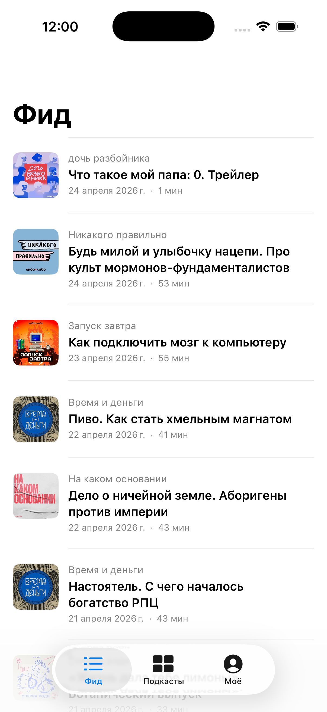

# 2026-04-25 — Шаг 1.1: Browse — Фид и Подкасты с реальными RSS (сессия 4)

**Контекст:** Илья дал три указания: (1) убрать xcodegen, собирать прямо в Xcode; (2) сжать план в 2–3 раза — поменьше шагов, побыстрее результат; (3) пока он пробует 1.0, я могу идти дальше. Эта сессия — выполнение фазы 1.1 и параллельная подготовка к 1.2.

## Что сделано

### Хаускипинг (коммит [`3b1db07`](https://github.com/Krasilshchik3000/LiboLibo/commit/3b1db07))

- `LiboLibo.xcodeproj/` положен в репо. xcodegen больше не нужен. Open in Xcode → Cmd+R.
- pbxproj переведён на `PBXFileSystemSynchronizedRootGroup` — новые `.swift` файлы в `LiboLibo/` подхватываются Xcode автоматически без правок проекта.
- Добавлен shared scheme в `xcshareddata/xcschemes/LiboLibo.xcscheme`.
- `project.yml` удалён, `.gitignore` больше не исключает `*.xcodeproj/`.
- Спецификация шага 1 пересобрана в три фазы: Browse (1.1), Listen (1.2), Save & polish (1.3).

### Browse (фаза 1.1)

Новые файлы в `LiboLibo/`:

- `Models/Podcast.swift` — `Podcast { id, name, artist, feedUrl, artworkUrl }`.
- `Models/Episode.swift` — `Episode { id, podcastId, podcastName, podcastArtworkUrl, title, summary, pubDate, duration, audioUrl }`.
- `Services/RSSParser.swift` — парсер на `XMLParser`. Достаёт `<item>` → title, description, pubDate (RFC 822), `<enclosure>` URL, `<itunes:duration>`, guid.
- `Services/PodcastsRepository.swift` — `@MainActor @Observable`: подкасты загружаются из бандла (`podcasts.json`), все выпуски параллельно через `withTaskGroup`, сортируются по `pubDate` desc.
- `Resources/podcasts.json` — копия [`docs/specs/podcasts-feeds.json`](../specs/podcasts-feeds.json) для бандла.
- `App/LiboLiboApp.swift` — создаёт `PodcastsRepository` и пробрасывает через `.environment(_:)`.
- `Features/Feed/EpisodeRow.swift` — общая ячейка выпуска (используется и в Фиде, и в детальном экране подкаста).
- `Features/Feed/FeedView.swift` — `List` всех выпусков с pull-to-refresh.
- `Features/Podcasts/PodcastsView.swift` — `LazyVGrid` всех 44 подкастов с обложками, тап → `PodcastDetailView`.
- `Features/Podcasts/PodcastDetailView.swift` — экран подкаста с описанием и списком его выпусков.

### Архитектурные решения

- **Без сторонних зависимостей.** Только Foundation + SwiftUI. RSS-парсинг — `XMLParser`, JSON — `Codable`, картинки — `AsyncImage`.
- **Один репозиторий-источник правды** через `@Environment` — Фид и Подкасты делят данные, лента не парсится дважды.
- **Параллельная загрузка** 44 фидов через `TaskGroup` — на симуляторе 6–10 сек до полной ленты.
- **Никаких ошибок на UI-нити:** `@MainActor` на репозитории, сетевые `nonisolated static func` для фоновой загрузки.

## DoD фазы 1.1 — закрыты

- [x] Приложение собирается (`** BUILD SUCCEEDED **`) и запускается в симуляторе iPhone 17.
- [x] На «Фиде» отображаются реальные выпуски подкастов Либо-Либо, отсортированные по дате (свежие сверху).
- [x] Каждая ячейка показывает обложку, название подкаста, заголовок выпуска, дату, длительность.
- [x] На «Подкастах» — сетка из 44 подкастов с обложками. Тап открывает экран подкаста с его выпусками.
- [x] Кириллица читается, dynamic type работает (системные шрифты).

## Скриншот

Видно: «Дочь разбойника», «Никакого правильно», «Запуск завтра», «Время и деньги», «На каком основании» — реальные подкасты студии, реальные выпуски, реальные обложки и даты.

## Что НЕ сделано (по плану)

- Плеер не подключён — это фаза 1.2.
- Подписки, профиль, polish — фаза 1.3.
- Шрифт — пока системный SF (открытый вопрос про Gerbera vs OFL-альтернативы).

## Дальше — фаза 1.2 (Listen)

Следующая сессия: тап по выпуску → играет; mini-player снизу; разворачивается в полноэкранный; контролы play/pause/±10/скорость; background audio + lock screen controls. Стартую сразу, пока Илья тестирует 1.1.
