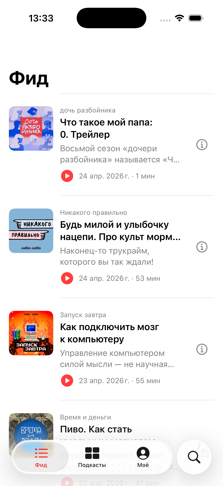

# 2026-04-25 — Шаг 1.7: Apple-Podcasts-style фид, экран выпуска, оффлайн (сессия 10)

**Контекст:** Илья прислал шесть последовательных правок на 1.6:
1. URL-ы попадают в превью описаний — починить, сентенции должны быть «настоящие».
2. Из фида нет возможности попасть в сам выпуск — должен быть отдельный экран выпуска.
3. В плеере должно быть видно описание выпуска.
4. Должна быть оффлайн-загрузка из фида, экрана выпуска и плеера.
5. Тап в фиде должен играть выпуск (главная функция), а провалиться в выпуск — допфункция.
6. Фид мелкий и серый — пересмотреть по гайдам Apple Podcasts.
7. Плеер сломан после правок 1.6 — обложка съехала, описание выезжает за поля.
8. Добавить отдельную секцию «Скачано» в «Моё» со swipe-удалением.

## Что сделано

### URL и «настоящие» предложения

[`Services/RSSParser.swift`](../../LiboLibo/Services/RSSParser.swift):
- Новое свойство `String.withoutURLs` режет `https?://…`, `www.…`, потом трим хвостовых разделителей и пробелов.
- `firstSentences(maxCount:)` теперь сначала убирает URL, потом разбивает на предложения. Игнорирует «предложения» из 1–2 символов (мусор от аббревиатур).
- Правило Ильи остаётся: 1 предложение, либо 2 если первое < 2 слов.

### Apple-Podcasts-style фид

[`Features/Feed/EpisodeRow.swift`](../../LiboLibo/Features/Feed/EpisodeRow.swift) — переработан:
- Обложка **80×80** (было 56), `RoundedRectangle(cornerRadius: 10)`.
- Иерархия:
  - `.caption` — название подкаста (мелким серым).
  - **`.headline`** — заголовок выпуска (был `.subheadline`/.semibold, теперь крупнее и читабельнее).
  - `.subheadline` (.secondary) — превью описания, до 2 строк.
  - `.footnote` — нижняя строка с красным `play.circle.fill` + `дата · длительность`.
- Padding `.vertical, 8` — больше «воздуха» между строк.

### Тап = играть, info-кнопка = детали

Новый компонент [`EpisodeListItem`](../../LiboLibo/Features/Feed/FeedView.swift#L52) — две кнопки в `HStack`:
- Левая (на всю ширину) — обёртка над `EpisodeRow`, action = `player.play(episode)`.
- Правая — иконка `info.circle` (44×44 hit zone), action = программная навигация на `EpisodeDetailView`.

Используется в FeedView, PodcastDetailView, ProfileView, SearchView. Плюс `swipeActions(.trailing)` со скачиванием/удалением загрузки.

### Экран выпуска

Новый файл [`Features/Episodes/EpisodeDetailView.swift`](../../LiboLibo/Features/Episodes/EpisodeDetailView.swift):
- Шапка: обложка 110×110 + название подкаста + заголовок + дата · длина.
- Action row: красный `Слушать` (`.borderedProminent`) + `Скачать` (`.bordered`). Оба `frame(minHeight: 44)` по HIG.
- Полное описание из RSS, `.textSelection(.enabled)`.
- Открывается из любого списка по тапу на `info.circle` или с экрана подкаста.

### Оффлайн-загрузка

Новый [`Services/DownloadService.swift`](../../LiboLibo/Services/DownloadService.swift):
- Хранит файлы в `Documents/Downloads/<sha-like-hex-key>.mp3`.
- `enum Status: notDownloaded | downloading | downloaded` для каждого выпуска.
- `struct Item` — снимок метаданных скачанного выпуска (id, title, podcast, artwork, audioUrl, duration, summary, downloadedAt) — нужен, чтобы «Моё» могла показать секцию «Скачано» без обращения к сети.
- При скачивании — `URLSession.shared.download(from:)` → `moveItem(at:to:)`. После успеха — добавить в `items[]` и сохранить в UserDefaults.
- При удалении — `removeItem(at:)` + `items.removeAll`.
- `rebuildStatuses()` при инициализации сверяет `items` с реальными файлами, чтобы выпуски, удалённые извне, не висели «скачанными».

[`Features/Episodes/DownloadButton.swift`](../../LiboLibo/Features/Episodes/DownloadButton.swift) — реюзаемый компонент в двух стилях:
- `.icon` — для плеера и компактных мест (44×44).
- `.button` — для экрана выпуска (`.bordered`, `frame(maxWidth: .infinity)`).
- Циклирует state: notDownloaded → downloading → downloaded → удалить.

[`PlayerService`](../../LiboLibo/Services/PlayerService.swift) теперь имеет `localUrlResolver: ((Episode) -> URL?)?`. App.onAppear устанавливает резолвер, который проверяет `DownloadService.localUrl(for:)`. При `play()` сначала пробуется локальный URL — если файл есть, играем с диска без сети.

### Секция «Скачано» в Моё

[`ProfileView`](../../LiboLibo/Features/Profile/ProfileView.swift) — между «Подписки» и «Свежее у подписок» теперь секция **«Скачано»**:
- ForEach по `downloads.items`, тот же `EpisodeListItem`.
- `swipeActions(.trailing)` с **destructive** Button «Удалить» — удаляет файл и снимает статус.
- Если ничего не скачано — секция не отображается.

### Плеер починен

[`Features/Player/PlayerView.swift`](../../LiboLibo/Features/Player/PlayerView.swift) полностью переписан:
- **Без `ScrollView`** — фиксированный `VStack` в `GeometryReader`, обложка ограничена `min(geo.width - 64, 360)`, всегда внутри полей.
- **Описание выпуска вынесено в отдельный sheet** — кнопка `doc.text` в нижнем ряду пилюль открывает `EpisodeNotesSheet` с навигацией и `presentationDetents([.large])`. Не выезжает.
- Внизу — компактная строка из 4 пилюль/кнопок: speed (1×) · sleep (Сон) · download · описание.
- Backdrop — размытая обложка, `Color.black.opacity(0.25)` поверх. `.preferredColorScheme(.dark)` на корне, чтобы статус-бар был светлый и кнопки читались.

## Скриншот фида (Apple-Podcasts стиль)

Видно: 80pt обложка, крупный заголовок («Что такое мой папа: 0. Трейлер»), описание-превью без URL («Восьмой сезон «дочери разбойника» называется «Ч…»), красный play-индикатор с датой и длительностью, info-кнопка справа.

## Что НЕ закрыто

- Программная регрессия: тапы по pills/info часто мажут координатами после перемещения окна симулятора. Во время сессии часть скриншотов получилась без ожидаемых тап-событий — нужен интерактивный тест на стороне Ильи.
- iCloud-синхронизация подписок и скачанных — пока всё локальное (UserDefaults / Documents).

## DoD фазы 1.7

- [x] Build: `** BUILD SUCCEEDED **`.
- [x] Свежий `.app` установлен и запущен на симуляторе.
- [x] URL-ы убираются из превью.
- [x] Тап в фиде по строке = немедленное воспроизведение; info → экран выпуска.
- [x] EpisodeDetailView показывает описание и кнопки «Слушать» / «Скачать».
- [x] DownloadService скачивает в Documents/Downloads, проигрывает локальную копию, помнит между запусками.
- [x] Секция «Скачано» в «Моё» со swipe-удалением.
- [x] Плеер не выезжает и описание открывается отдельным sheet.
